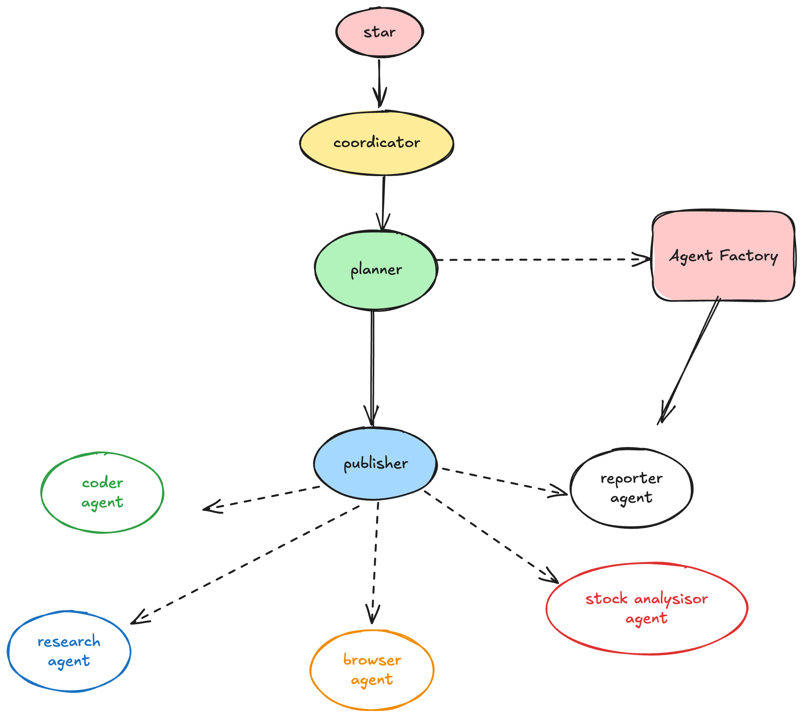

# cooragent
[](https://www.python.org/downloads/)
[](https://opensource.org/licenses/MIT)
[](./assets/wechat_community.jpg)
[](https://discord.gg/StFHzvmz)


[English](./README.md) | [简体中文](./README_zh.md)

# What is Cooragent

Cooragent is an AI agent collaboration community where you can create specific-function agents with a single sentence and collaborate with other agents to complete complex tasks. Agents can be freely combined to create unlimited possibilities. Meanwhile, you can publish your agents to the community and share them with others.


<p align="center">
  <a href="./assets/demo.mp4">
    
  </a>
</p>

## Quick Installation

1. Installation using conda
```bash
git clone https://github.com/LeapLabTHU/cooragent.git
cd cooragent

# Create and activate a conda environment
conda create -n cooragent python=3.12
conda activate cooragent

# Install dependencies
pip install -e .

# Optional: If you need to use the browser tool
playwright install

# Configure environment
cp .env.example .env

# Run the project (Example, assuming cli.py is the entry point)
python cli.py # Adjust if your entry point is different
```

2. Installation using venv
```bash
# Clone repository
git clone https://github.com/LeapLabTHU/cooragent.git
cd cooragent

# Create and activate a virtual environment with uv
uv python install 3.12
uv venv --python 3.12

source .venv/bin/activate  # For Windows: .venv\Scripts\activate

# Install dependencies
uv sync

# Optional: If you need to use the browser tool
playwright install

# Configure environment
cp .env.example .env
# Edit .env file and fill in your API keys

# Run the project (Example, assuming cli.py is the entry point)
uv run cli.py # Adjust if your entry point is different
```


## Configuration

Create `.env` file in project root:

```bash
cp .env.example .env
```

## What Makes Cooragent Different

## Feature Comparison
<table style="width: 100%;">
  <tr>
    <th align="center">Feature</th>
    <th align="center">cooragent</th>
    <th align="center">open-manus</th>
    <th align="center">cooragent</th> <!-- Note: Duplicate column header from source -->
    <th align="center">OpenAI Assistant Operator</th>
  </tr>
  <tr>
    <td align="center">Implementation</td>
    <td align="center">Agent collaboration through autonomous creation to achieve complex functions</td>
    <td align="center">Tool-based complex task execution</td>
    <td align="center">Tool-based complex task execution</td> <!-- Note: Duplicate description from source -->
    <td align="center">Tool-based complex task execution</td>
  </tr>
  <tr>
    <td align="center">Supported LLMs</td>
    <td align="center">Diverse options</td>
    <td align="center">Diverse options</td>
    <td align="center">Diverse options</td>
    <td align="center">OpenAI only</td>
  </tr>
  <tr>
    <td align="center">MCP Support</td>
    <td align="center">✅</td>
    <td align="center">❌</td>
    <td align="center">❌</td>
    <td align="center">✅</td>
  </tr>
  <tr>
    <td align="center">Agent Collaboration</td>
    <td align="center">✅</td>
    <td align="center">❌</td>
    <td align="center">✅</td>
    <td align="center">✅</td>
  </tr>
  <tr>
    <td align="center">Multi-Agent Runtime Support</td>
    <td align="center">✅</td>
    <td align="center">❌</td>
    <td align="center">❌</td>
    <td align="center">❌</td>
  </tr>
  <tr>
    <td align="center">Observability</td>
    <td align="center">✅</td>
    <td align="center">✅</td>
    <td align="center">❌</td>
    <td align="center">❌</td>
  </tr>
  <tr>
    <td align="center">Local Deployment</td>
    <td align="center">✅</td>
    <td align="center">✅</td>
    <td align="center">✅</td>
    <td align="center">❌</td>
  </tr>
</table>


## One-Sentence Agent Creation
Enter the cooragent command tool interface
```
python cli.py
```
<p align="center">

</p>

Create a Xiaomi stock analysis agent with a single sentence
```
run -t agent_factory -u <user> -m 'Create a stock analysis expert agent, analyze the past month's Xiaomi stock price trend, predict the stock price trend of the next trading day, and give a buy or sell suggestion.'
```

## Edit Agent
```
edit-agent -n <agent_name> -i
```

## Query Agent
```
list-agents -u <user-id> -m <regex>
```

## Remove Agent
```
remove-agent -n <agent_name> -u <user-id>
```

## Complete Complex Tasks with Agent Teams
```
run -t agent_workflow -u <user> -m 'use the task planning agent, crawler agent, code running agent, browser operation agent, report writing agent, and file operation agent to plan a trip to Yunnan Province during the May Day holiday in 2025. First, use the crawler agent to crawl the scenic information of Yunnan Province, and use the browser operation agent to browse the scenic information. Select the top 10 most worth visiting scenic spots. Then plan a 5-day travel itinerary, use the report writing agent to generate a travel report, and finally use the file operation agent to save the report as a pdf file.'
```

## MCP-based Agent Creation
```
server_params = StdioServerParameters(
    command="python",
    args=[str(get_project_root()) + "/src/mcp/excel_mcp/server.py"]
)

async def excel_agent():
    async with stdio_client(server_params) as (read, write):
        async with ClientSession(read, write) as session:
            # Initialize the connection
            await session.initialize()
            # Get tools
            tools = await load_mcp_tools(session)
            # Create and run the agent
            agent = create_react_agent(model, tools)
            return agent


agent = asyncio.run(excel_agent())
agent_obj = Agent(user_id="share", 
                  agent_name="mcp_excel_agent", 
                  nick_name="mcp_excel_agent", 
                  description="The agent are good at manipulating excel files, which includes creating, reading, writing, and analyzing excel files", 
                  llm_type=LLMType.BASIC, 
                  selected_tools=[], 
                  prompt="")

MCPManager.register_agent("mcp_excel_agent", agent, agent_obj)
```
Complete code see [src/mcp/excel_agent.py](./src/mcp/excel_agent.py)
## Edit Agents

## Architecture

Cooragent implements a hierarchical multi-agent system with a supervisor agent coordinating specialized agents to complete complex tasks:

<p align="center">
  
</p>


## Web Interface

Cooragent provides a default web interface. Refer to [brainleap/brainleap-ai](https://www.brainleap.ai) for more details.

## Contribution

We welcome various forms of contribution! Whether it's fixing typos, improving documentation, or adding new features, your help will be greatly appreciated. Please check out our [contribution guide](CONTRIBUTING.md) to learn how to get started.

## License

This project is open-source, based on the [MIT License](LICENSE).

## Acknowledgments

Special thanks to all open-source projects and contributors that made cooragent possible. We stand on the shoulders of giants.
