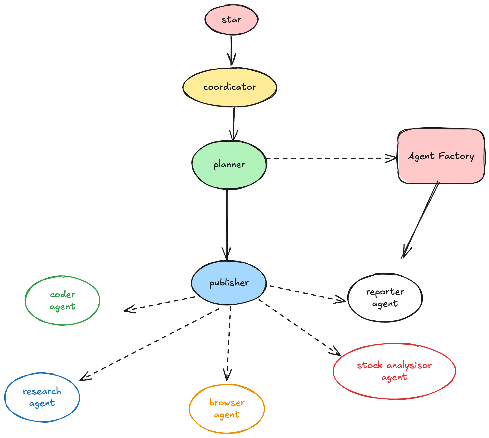

# cooragent

[](https://www.python.org/downloads/)
[](https://opensource.org/licenses/MIT)
[](./assets/wechat_community.jpg)
[](https://discord.gg/m3MszDcn)

[English](./README.md) | [简体中文](./README_zh.md)

# Cooragent 是什么

Cooragent 是一个 AI 智能体协作社区，在这个社区中，你可以通过一句话创建一个特定功能的智能体，并与其他智能体协作完成复杂任务。智能体可以自由组合，创造出无限可能。与此同时，你还可以将你的智能体发布到社区中，与其他人共享。

## 演示视频

> **Task**: Create a stock analysis agent that uses search tools to find Tencent's stock price information for the last seven days and Tencent's financial status. Then use the browser to find a couple of investor analyses about Tencent's recent stock performance (one or two entries). Based on this information, conduct a very detailed textual analysis, and finally generate a Chinese analysis report containing line charts and text, saved in a docx file.

> **任务**：创建一个股票分析 agent，用搜索工具搜索腾讯最近七天的股价信息和腾讯公司财经状况，然后使用浏览器简单查找股民对腾讯近期的股票分析（一到两条），凭借这些信息进行非常详细的文字分析，最后形成一个含有折线图和文字的中文分析报告，保存在docx文件中。

[](./assets/demo.mp4)

> **Task**: Create an agent that searches for and learns about recently released OpenAI models and their characteristics, then use the created agent to write an article, and use the browser to publish it to the Xiaohongshu (RED) community.

> **任务**：创建一个智能体，等节開架第马米货书风指的安留：蒸后搜來最近何里于问新发布了哪些模型，这些模型有什么特点，然后用创建的智能休写个文章，并用浏览歸发布到小红书社区。

## 快速安装

```bash
# 克隆仓库
git clone https://github.com/SeamLessAI-Inc/cooragent
cd cooragent

# 用uv创建并激活虚拟环境
uv python install 3.12
uv venv --python 3.12

source .venv/bin/activate  # Windows系统使用: .venv\Scripts\activate

# 安装依赖
uv sync

# 配置环境
cp .env.example .env
# 编辑 .env 文件，填入你的 API 密钥

# 运行项目
uv run main.py
```

## Cooragent 有什么不同

## 功能比较
<table style="width: 100%;">
  <tr>
    <th align="center">功能</th>
    <th align="center">cooragent</th>
    <th align="center">open-manus</th>
    <th align="center">cooragent</th>
    <th align="center">OpenAI Assistant Operator</th>
  </tr>
  <tr>
    <td align="center">实现原理</td>
    <td align="center">基于 Agent 自主创建实现不同 Agent 之间的协作完成复杂功能</td>
    <td align="center">基于工具调用实现复杂功能</td>
    <td align="center">基于工具调用实现复杂功能</td>
    <td align="center">基于工具调用实现复杂功能</td>
  </tr>
  <tr>
    <td align="center">支持的 LLMs</td>
    <td align="center">丰富多样</td>
    <td align="center">丰富多样</td>
    <td align="center">丰富多样</td>
    <td align="center">仅限 OpenAI</td>
  </tr>
  <tr>
    <td align="center">MCP 支持</td>
    <td align="center">✅</td>
    <td align="center">❌</td>
    <td align="center">❌</td>
    <td align="center">✅</td>
  </tr>
  <tr>
    <td align="center">Agent 协作</td>
    <td align="center">✅</td>
    <td align="center">❌</td>
    <td align="center">✅</td>
    <td align="center">✅</td>
  </tr>
  <tr>
    <td align="center">多 Agent Runtime 支持</td>
    <td align="center">✅</td>
    <td align="center">❌</td>
    <td align="center">❌</td>
    <td align="center">❌</td>
  </tr>
  <tr>
    <td align="center">可观测性</td>
    <td align="center">✅</td>
    <td align="center">✅</td>
    <td align="center">❌</td>
    <td align="center">❌</td>
  </tr>
  <tr>
    <td align="center">本地部署</td>
    <td align="center">✅</td>
    <td align="center">✅</td>
    <td align="center">✅</td>
    <td align="center">❌</td>
  </tr>
</table>


## 架构

cooragent 实现了一个分层的多智能体系统，其中有一个主管智能体协调专门的智能体来完成复杂任务：



## 一句话创建智能体

## 编辑智能体

## 通过 MCP 方式创建智能体

##【发布/共享】智能体

## 使用一组智能体完成复杂任务

基于工具调用实现复杂功能

### 配置

在项目根目录创建 `.env` 文件并配置以下环境变量：

```bash
cp .env.example .env
```


## web 端

cooragent 提供一个默认的网页界面。

请参考 [brainleap/brainleap-ai](https://www.brainleap.ai) 项目了解更多信息。


## 贡献

我们欢迎各种形式的贡献！无论是修复错别字、改进文档，还是添加新功能，您的帮助都将备受感激。请查看我们的[贡献指南](CONTRIBUTING.md)了解如何开始。

## 许可证

本项目是开源的，基于 [MIT 许可证](LICENSE)。

## 致谢

特别感谢所有让 cooragent 成为可能的开源项目和贡献者。我们站在巨人的肩膀上。

## 为什么选择 Cooragent

## 与其他工具的比较
