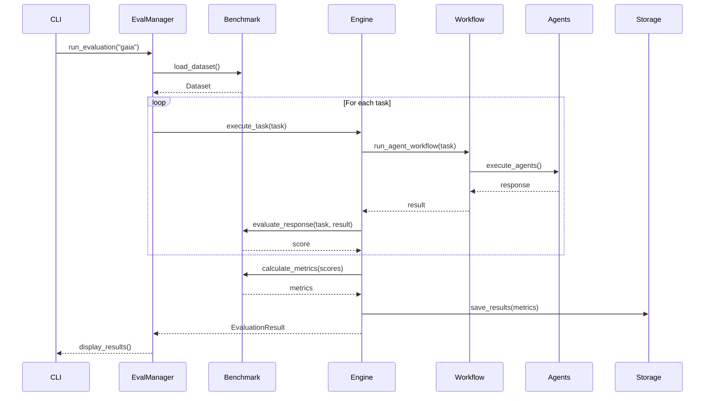

# Cooragent Evaluation System Implementation Guide

## Executive Summary

This guide outlines the implementation of a comprehensive evaluation and benchmarking system for Cooragent, starting with the GAIA (General AI Assistants) benchmark. The system is designed to be modular, extensible, and seamlessly integrated with the existing Cooragent architecture.

## Table of Contents

1. [System Overview](#system-overview)
2. [Architecture Design](#architecture-design)
3. [Core Components](#core-components)
4. [GAIA Benchmark Implementation](#gaia-benchmark-implementation)
5. [Integration Points](#integration-points)
6. [File Structure](#file-structure)
7. [Implementation Phases](#implementation-phases)
8. [Configuration & Settings](#configuration--settings)
9. [Data Flow](#data-flow)
10. [Extensibility Framework](#extensibility-framework)
11. [Testing Strategy](#testing-strategy)
12. [Performance Considerations](#performance-considerations)

## System Overview

### Goals
- **Primary**: Evaluate Cooragent's performance on GAIA benchmark tasks
- **Secondary**: Create extensible framework for future benchmarks
- **Tertiary**: Generate actionable insights for system improvement

### Key Requirements
- Non-intrusive integration with existing Cooragent workflow
- Support for parallel evaluation runs
- Comprehensive metrics collection
- Automated report generation
- Result persistence and comparison
- Benchmark-agnostic core architecture

### Success Metrics
- Complete GAIA benchmark support
- <5% overhead on normal operations
- Extensible to new benchmarks in <1 day
- Automated CI/CD integration ready

## Architecture Design

### High-Level Architecture

```
┌─────────────────────────────────────────────────┐
│              Evaluation Layer                    │
│  ┌──────────┬───────────┬──────────────────┐   │
│  │   CLI    │    API    │   Web Dashboard  │   │
│  └──────────┴───────────┴──────────────────┘   │
├─────────────────────────────────────────────────┤
│           Evaluation Manager                     │
│  ┌──────────────────────────────────────────┐   │
│  │  Orchestration, Scheduling, Monitoring   │   │
│  └──────────────────────────────────────────┘   │
├─────────────────────────────────────────────────┤
│         Benchmark Components                     │
│  ┌─────────┬──────────┬────────────────────┐   │
│  │  GAIA   │  Future  │  Custom Benchmarks │   │
│  └─────────┴──────────┴────────────────────┘   │
├─────────────────────────────────────────────────┤
│          Evaluation Engine                       │
│  ┌─────────┬──────────┬────────────────────┐   │
│  │ Dataset │ Executor │    Evaluator       │   │
│  │ Loader  │          │                    │   │
│  └─────────┴──────────┴────────────────────┘   │
├─────────────────────────────────────────────────┤
│         Existing Cooragent System               │
│  ┌──────────────────────────────────────────┐   │
│  │   Workflow Engine → Agent System         │   │
│  └──────────────────────────────────────────┘   │
└─────────────────────────────────────────────────┘
```

### Design Principles

1. **Separation of Concerns**: Evaluation system is independent but integrated
2. **Minimal Intrusion**: No changes to core agent logic required
3. **Extensibility First**: New benchmarks as plugins
4. **Performance Isolation**: Evaluation doesn't impact production
5. **Observability**: Comprehensive logging and metrics

## Core Components

### 1. Evaluation Manager (`src/evaluation/manager.py`)

```python
class EvaluationManager:
    """Central orchestrator for all evaluation activities"""
    
    def __init__(self):
        self.benchmark_registry = BenchmarkRegistry()
        self.evaluation_engine = EvaluationEngine()
        self.result_store = ResultStore()
    
    async def run_evaluation(
        self,
        benchmark_name: str,
        config: EvaluationConfig,
        **kwargs
    ) -> EvaluationResult:
        """Main entry point for running evaluations"""
        pass
    
    async def schedule_evaluation(self, schedule_config: ScheduleConfig):
        """Schedule periodic evaluations"""
        pass
    
    def get_evaluation_history(self, filters: Dict) -> List[EvaluationResult]:
        """Retrieve past evaluation results"""
        pass
```

### 2. Benchmark Registry (`src/evaluation/registry.py`)

```python
class BenchmarkRegistry:
    """Registry for all available benchmarks"""
    
    def register_benchmark(self, benchmark: BaseBenchmark):
        """Register a new benchmark"""
        pass
    
    def get_benchmark(self, name: str) -> BaseBenchmark:
        """Retrieve benchmark by name"""
        pass
    
    def list_benchmarks(self) -> List[BenchmarkInfo]:
        """List all available benchmarks"""
        pass

class BaseBenchmark(ABC):
    """Abstract base class for all benchmarks"""
    
    @abstractmethod
    async def load_dataset(self) -> Dataset:
        """Load benchmark dataset"""
        pass
    
    @abstractmethod
    async def evaluate_response(
        self, 
        task: Task, 
        response: Any
    ) -> EvaluationScore:
        """Evaluate a single response"""
        pass
    
    @abstractmethod
    def calculate_metrics(
        self, 
        scores: List[EvaluationScore]
    ) -> BenchmarkMetrics:
        """Calculate aggregate metrics"""
        pass
```

### 3. Evaluation Engine (`src/evaluation/engine.py`)

```python
class EvaluationEngine:
    """Core execution engine for evaluations"""
    
    async def execute_benchmark(
        self,
        benchmark: BaseBenchmark,
        config: EvaluationConfig
    ) -> EvaluationResult:
        """Execute a benchmark evaluation"""
        # 1. Load dataset
        # 2. Execute tasks
        # 3. Evaluate responses
        # 4. Calculate metrics
        # 5. Generate report
        pass
    
    async def execute_task(
        self,
        task: Task,
        config: ExecutionConfig
    ) -> TaskResult:
        """Execute a single evaluation task"""
        pass
```

### 4. Dataset Management (`src/evaluation/dataset.py`)

```python
class Dataset:
    """Container for benchmark datasets"""
    
    def __init__(self, tasks: List[Task]):
        self.tasks = tasks
        self.metadata = {}
    
    def filter(self, criteria: Dict) -> 'Dataset':
        """Filter dataset by criteria"""
        pass
    
    def split(self, ratios: List[float]) -> List['Dataset']:
        """Split dataset into subsets"""
        pass

class Task:
    """Individual evaluation task"""
    
    task_id: str
    question: str
    context: Optional[Dict]
    expected_output: Any
    metadata: Dict
    evaluation_criteria: Dict
```

## GAIA Benchmark Implementation

### GAIA-Specific Components (`src/evaluation/benchmarks/gaia/`)

#### 1. GAIA Benchmark Class (`gaia_benchmark.py`)

```python
class GAIABenchmark(BaseBenchmark):
    """GAIA benchmark implementation"""
    
    def __init__(self):
        self.name = "GAIA"
        self.version = "1.0"
        self.dataset_url = "https://huggingface.co/datasets/gaia-benchmark/GAIA"
        self.evaluator = GAIAEvaluator()
    
    async def load_dataset(self) -> Dataset:
        """Load GAIA dataset from HuggingFace"""
        # Download and parse GAIA dataset
        # Convert to internal Task format
        pass
    
    async def evaluate_response(
        self,
        task: Task,
        response: Any
    ) -> EvaluationScore:
        """GAIA-specific evaluation logic"""
        return self.evaluator.evaluate(task, response)
```

#### 2. GAIA Evaluator (`gaia_evaluator.py`)

```python
class GAIAEvaluator:
    """GAIA-specific evaluation logic"""
    
    def evaluate(self, task: Task, response: Any) -> EvaluationScore:
        """
        Evaluate response according to GAIA criteria:
        - Exact match for factual questions
        - Semantic similarity for open-ended questions
        - Tool usage appropriateness
        - Reasoning quality
        """
        score = EvaluationScore()
        
        # Implement GAIA evaluation rubric
        score.accuracy = self._evaluate_accuracy(task, response)
        score.completeness = self._evaluate_completeness(task, response)
        score.efficiency = self._evaluate_efficiency(task, response)
        
        return score
```

#### 3. GAIA Dataset Loader (`gaia_loader.py`)

```python
class GAIADatasetLoader:
    """Handles GAIA dataset loading and preprocessing"""
    
    async def load_from_huggingface(self) -> Dataset:
        """Download and load GAIA dataset"""
        pass
    
    async def load_from_local(self, path: str) -> Dataset:
        """Load GAIA dataset from local files"""
        pass
    
    def preprocess_task(self, raw_task: Dict) -> Task:
        """Convert GAIA format to internal Task format"""
        pass
```

### GAIA Integration Specifics

#### Task Adaptation Layer (`src/evaluation/adapters/gaia_adapter.py`)

```python
class GAIATaskAdapter:
    """Adapts GAIA tasks to Cooragent format"""
    
    def adapt_to_cooragent(self, gaia_task: Task) -> str:
        """Convert GAIA task to Cooragent user query"""
        # Handle special GAIA requirements:
        # - File attachments
        # - Multi-modal inputs
        # - Complex reasoning chains
        pass
    
    def adapt_from_cooragent(self, cooragent_response: Dict) -> Any:
        """Convert Cooragent response to GAIA format"""
        pass
```

## Integration Points

### 1. CLI Integration (`cli.py` modifications)

```python
# Add new commands to existing CLI
@app.command()
def evaluate(
    benchmark: str = typer.Option("gaia", help="Benchmark to run"),
    subset: str = typer.Option("test", help="Dataset subset"),
    config: str = typer.Option(None, help="Evaluation config file"),
    output: str = typer.Option("./results", help="Output directory")
):
    """Run benchmark evaluation"""
    manager = EvaluationManager()
    result = manager.run_evaluation(benchmark, subset, config)
    # Display results
    pass

@app.command()
def evaluate_history():
    """Show evaluation history"""
    pass

@app.command()
def compare_evaluations(
    run_id1: str,
    run_id2: str
):
    """Compare two evaluation runs"""
    pass
```

### 2. Workflow Integration (`src/evaluation/workflow_adapter.py`)

```python
class WorkflowAdapter:
    """Adapts evaluation tasks to Cooragent workflows"""
    
    def __init__(self, workflow_engine):
        self.workflow_engine = workflow_engine
    
    async def execute_as_workflow(
        self,
        task: Task,
        mode: str = "production"
    ) -> Dict:
        """Execute evaluation task using Cooragent workflow"""
        # Convert task to workflow input
        # Execute workflow
        # Capture and return results
        pass
```

### 3. Agent System Integration

```python
class EvaluationAgentProxy:
    """Proxy for routing evaluation tasks to agents"""
    
    def __init__(self, agent_manager):
        self.agent_manager = agent_manager
    
    async def route_task(self, task: Task) -> AgentResponse:
        """Route evaluation task to appropriate agents"""
        # Determine best agent configuration
        # Execute with monitoring
        # Return response with metadata
        pass
```

## File Structure

```
cooragent/
├── src/
│   ├── evaluation/                 # New evaluation module
│   │   ├── __init__.py
│   │   ├── manager.py              # Evaluation Manager
│   │   ├── registry.py             # Benchmark Registry
│   │   ├── engine.py               # Evaluation Engine
│   │   ├── dataset.py              # Dataset management
│   │   ├── metrics.py              # Metrics calculation
│   │   ├── report.py               # Report generation
│   │   ├── storage.py              # Result storage
│   │   ├── adapters/               # Task adapters
│   │   │   ├── __init__.py
│   │   │   ├── gaia_adapter.py
│   │   │   └── workflow_adapter.py
│   │   └── benchmarks/             # Benchmark implementations
│   │       ├── __init__.py
│   │       ├── base.py             # Base benchmark class
│   │       └── gaia/
│   │           ├── __init__.py
│   │           ├── gaia_benchmark.py
│   │           ├── gaia_evaluator.py
│   │           ├── gaia_loader.py
│   │           └── gaia_metrics.py
│   └── interface/
│       └── evaluation.py           # Evaluation data models
├── config/
│   └── evaluation/                 # Evaluation configs
│       ├── default.yaml
│       └── benchmarks/
│           └── gaia.yaml
├── store/
│   └── evaluation/                 # Evaluation results storage
│       ├── results/
│       ├── reports/
│       └── datasets/
└── tests/
    └── evaluation/                 # Evaluation tests
        ├── test_manager.py
        ├── test_engine.py
        └── benchmarks/
            └── test_gaia.py
```

## Implementation Phases

### Phase 1: Core Infrastructure (Week 1)
- [ ] Create evaluation module structure
- [ ] Implement EvaluationManager
- [ ] Implement BenchmarkRegistry
- [ ] Create base benchmark interfaces
- [ ] Set up result storage

### Phase 2: GAIA Implementation (Week 2)
- [ ] Implement GAIA dataset loader
- [ ] Create GAIA benchmark class
- [ ] Implement GAIA evaluator
- [ ] Create GAIA-specific metrics
- [ ] Test with sample GAIA tasks

### Phase 3: Integration (Week 3)
- [ ] Integrate with CLI
- [ ] Create workflow adapter
- [ ] Implement agent proxy
- [ ] Add configuration management
- [ ] Create basic reporting

### Phase 4: Testing & Optimization (Week 4)
- [ ] Comprehensive testing
- [ ] Performance optimization
- [ ] Documentation
- [ ] CI/CD integration
- [ ] Initial evaluation runs

## Configuration & Settings

### Evaluation Configuration (`config/evaluation/default.yaml`)

```yaml
evaluation:
  # General settings
  max_concurrent_tasks: 5
  timeout_per_task: 300  # seconds
  retry_failed_tasks: true
  max_retries: 3
  
  # Storage settings
  storage:
    type: "file"  # or "database"
    path: "./store/evaluation"
    retention_days: 90
  
  # Execution settings
  execution:
    mode: "production"  # or "launch", "polish"
    use_cache: true
    capture_reasoning: true
    capture_tool_usage: true
  
  # Reporting
  reporting:
    generate_html: true
    generate_json: true
    include_failed_tasks: true
    include_reasoning_traces: false

# Benchmark-specific settings
benchmarks:
  gaia:
    dataset_source: "huggingface"
    dataset_version: "latest"
    evaluation_criteria:
      - accuracy
      - completeness
      - efficiency
      - tool_usage
    subsets:
      - validation
      - test
```

### GAIA Configuration (`config/evaluation/benchmarks/gaia.yaml`)

```yaml
gaia:
  dataset:
    source: "huggingface"
    name: "gaia-benchmark/GAIA"
    cache_dir: "./store/evaluation/datasets/gaia"
    
  evaluation:
    # Scoring weights
    weights:
      accuracy: 0.4
      completeness: 0.3
      efficiency: 0.2
      tool_usage: 0.1
    
    # Task-specific settings
    task_types:
      factual:
        timeout: 60
        required_tools: ["search", "calculator"]
      reasoning:
        timeout: 180
        required_tools: ["python_repl", "search"]
      multi_modal:
        timeout: 120
        required_tools: ["vision", "search"]
    
    # Evaluation thresholds
    thresholds:
      pass_score: 0.7
      excellence_score: 0.9
```

## Data Flow

### Evaluation Execution Flow



## Extensibility Framework

### Adding New Benchmarks

#### 1. Create Benchmark Class

```python
# src/evaluation/benchmarks/new_benchmark/new_benchmark.py
class NewBenchmark(BaseBenchmark):
    def __init__(self):
        super().__init__()
        self.name = "NewBenchmark"
        self.version = "1.0"
    
    async def load_dataset(self) -> Dataset:
        # Implementation
        pass
    
    async def evaluate_response(self, task, response) -> EvaluationScore:
        # Implementation
        pass
```

#### 2. Register Benchmark

```python
# src/evaluation/benchmarks/__init__.py
from .new_benchmark import NewBenchmark

BENCHMARKS = {
    "gaia": GAIABenchmark,
    "new_benchmark": NewBenchmark,  # Add here
}
```

#### 3. Add Configuration

```yaml
# config/evaluation/benchmarks/new_benchmark.yaml
new_benchmark:
  dataset:
    source: "custom"
    path: "./datasets/new_benchmark"
  evaluation:
    criteria: ["criterion1", "criterion2"]
```

### Plugin Architecture

```python
class BenchmarkPlugin(ABC):
    """Plugin interface for external benchmarks"""
    
    @abstractmethod
    def get_benchmark(self) -> BaseBenchmark:
        pass
    
    @abstractmethod
    def get_config_schema(self) -> Dict:
        pass
    
    @abstractmethod
    def validate_environment(self) -> bool:
        pass
```

## Testing Strategy

### Unit Tests

```python
# tests/evaluation/test_gaia.py
class TestGAIABenchmark:
    def test_dataset_loading(self):
        """Test GAIA dataset loading"""
        pass
    
    def test_evaluation_accuracy(self):
        """Test evaluation scoring accuracy"""
        pass
    
    def test_metrics_calculation(self):
        """Test metrics calculation"""
        pass
```

### Integration Tests

```python
# tests/evaluation/test_integration.py
class TestEvaluationIntegration:
    async def test_end_to_end_evaluation(self):
        """Test complete evaluation flow"""
        pass
    
    async def test_workflow_integration(self):
        """Test workflow system integration"""
        pass
```

### Benchmark Validation

```python
# tests/evaluation/benchmarks/test_benchmark_validation.py
class TestBenchmarkValidation:
    def test_gaia_sample_tasks(self):
        """Validate against known GAIA examples"""
        pass
    
    def test_scoring_consistency(self):
        """Ensure scoring is consistent"""
        pass
```

## Performance Considerations

### Optimization Strategies

1. **Parallel Execution**
   ```python
   async def execute_tasks_parallel(tasks: List[Task], max_concurrent: int = 5):
       semaphore = asyncio.Semaphore(max_concurrent)
       async with semaphore:
           results = await asyncio.gather(*[execute_task(task) for task in tasks])
       return results
   ```

2. **Caching**
   ```python
   class EvaluationCache:
       def get_cached_result(self, task_hash: str) -> Optional[TaskResult]:
           pass
       
       def cache_result(self, task_hash: str, result: TaskResult):
           pass
   ```

3. **Resource Management**
   ```python
   class ResourceManager:
       def allocate_resources(self, task: Task) -> Resources:
           # Dynamic resource allocation based on task type
           pass
   ```

### Monitoring & Metrics

```python
class EvaluationMonitor:
    """Real-time monitoring of evaluation runs"""
    
    def track_progress(self, run_id: str) -> Progress:
        pass
    
    def get_resource_usage(self) -> ResourceMetrics:
        pass
    
    def estimate_completion_time(self, run_id: str) -> datetime:
        pass
```

## API Endpoints (Optional)

### RESTful API Design

```python
# src/evaluation/api.py
from fastapi import FastAPI, BackgroundTasks

app = FastAPI()

@app.post("/evaluation/run")
async def run_evaluation(
    benchmark: str,
    config: EvaluationConfig,
    background_tasks: BackgroundTasks
):
    """Start evaluation run"""
    pass

@app.get("/evaluation/status/{run_id}")
async def get_evaluation_status(run_id: str):
    """Get evaluation run status"""
    pass

@app.get("/evaluation/results/{run_id}")
async def get_evaluation_results(run_id: str):
    """Get evaluation results"""
    pass

@app.get("/evaluation/compare")
async def compare_evaluations(run_ids: List[str]):
    """Compare multiple evaluation runs"""
    pass
```

## Lightweight Runner (Recommended for CI/Headless)

To avoid importing heavy CLI dependencies, provide a minimal Python entrypoint for running evaluations:

- Script: `scripts/run_evaluation.py`
- Usage:
  ```bash
  conda run -n py310 python cooragent/scripts/run_evaluation.py -b gaia -l 0
  ```
- This approach is ideal for CI and minimal environments and can coexist with the CLI command.

## Error Handling

### Evaluation-Specific Exceptions

```python
class EvaluationException(Exception):
    """Base exception for evaluation system"""
    pass

class BenchmarkNotFoundException(EvaluationException):
    """Benchmark not found in registry"""
    pass

class DatasetLoadException(EvaluationException):
    """Failed to load dataset"""
    pass

class TaskExecutionException(EvaluationException):
    """Task execution failed"""
    pass

class EvaluationTimeoutException(EvaluationException):
    """Evaluation exceeded timeout"""
    pass
```

## Reporting & Visualization

### Report Generation

```python
class ReportGenerator:
    """Generate evaluation reports"""
    
    def generate_html_report(self, result: EvaluationResult) -> str:
        """Generate HTML report with charts"""
        pass
    
    def generate_markdown_report(self, result: EvaluationResult) -> str:
        """Generate Markdown report"""
        pass
    
    def generate_comparison_report(self, results: List[EvaluationResult]) -> str:
        """Generate comparison report"""
        pass
```

### Metrics Dashboard

```python
class MetricsDashboard:
    """Real-time metrics dashboard"""
    
    def get_current_metrics(self) -> Dict:
        pass
    
    def get_historical_trends(self, days: int = 30) -> Dict:
        pass
    
    def get_benchmark_comparison(self) -> Dict:
        pass
```

## Environment Variables

```bash
# Evaluation-specific environment variables
EVALUATION_ENABLED=true
EVALUATION_MAX_CONCURRENT=5
EVALUATION_TIMEOUT=300
EVALUATION_STORAGE_PATH=./store/evaluation
EVALUATION_CACHE_ENABLED=true
EVALUATION_CACHE_TTL=3600

# GAIA-specific
GAIA_DATASET_PATH=./store/evaluation/datasets/gaia
GAIA_USE_CACHED_DATASET=true
GAIA_EVALUATION_MODE=strict  # or "lenient"
HUGGINGFACE_TOKEN=your_token_here  # For dataset access
```

## Success Criteria

### Implementation Milestones

1. **Milestone 1**: Core evaluation infrastructure operational
2. **Milestone 2**: GAIA benchmark fully integrated
3. **Milestone 3**: First successful GAIA evaluation run
4. **Milestone 4**: Performance optimization complete
5. **Milestone 5**: Documentation and testing complete

### Acceptance Criteria

- [ ] Can run GAIA benchmark evaluation via CLI
- [ ] Results are accurately scored according to GAIA rubric
- [ ] Evaluation results are persisted and retrievable
- [ ] Can compare multiple evaluation runs
- [ ] System supports parallel task execution
- [ ] New benchmarks can be added without core changes
- [ ] Comprehensive test coverage (>80%)
- [ ] Performance overhead <5% on normal operations

## Next Steps for Implementation

1. **Start with Phase 1**: Create the core evaluation infrastructure
2. **Focus on GAIA Loader**: Implement GAIA dataset loading first
3. **Build Incrementally**: Test each component before integration
4. **Use Existing Patterns**: Follow Cooragent's existing architectural patterns
5. **Maintain Backwards Compatibility**: Ensure no breaking changes
6. **Document as You Go**: Update documentation with implementation details

## References & Resources

- [GAIA Benchmark Paper](https://arxiv.org/abs/2311.12983)
- [GAIA Dataset on HuggingFace](https://huggingface.co/datasets/gaia-benchmark/GAIA)
- [Cooragent Architecture](PROJECT.md)
- [Evaluation Best Practices](https://www.semanticscholar.org/paper/Evaluation-of-Large-Language-Models%3A-Challenges-Ziyu/...)

---

**Note for AI Implementation Agents**: This guide provides the complete context and blueprint for implementing the evaluation system. Start with Phase 1, follow the architectural patterns established here, and reference the existing Cooragent codebase for implementation patterns and conventions. The modular design allows for incremental development and testing. 